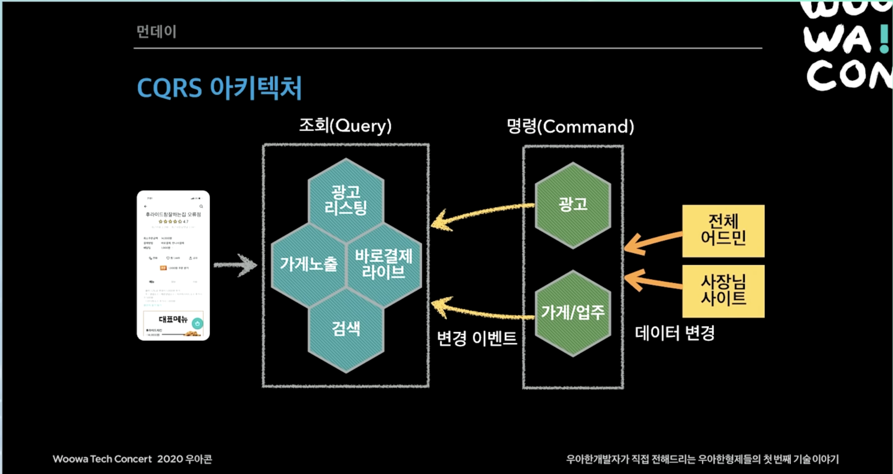

# MSA - 배달의민족 마이크로 서비스 여행기

## 2015 - 단일 서비스

- 하루 주문수 5만 이하
- MS SQL + PHP, ASP
- 대부분 루비DB(MS SQL) 스토어드 프로시저 방식 사용
- 루비DB 장애시 전체 서비스 장애

최종 - 테이블 700개 스토어드 프로시저 4000개의 거대한 모놀리틱 서비스...

하나의 데이터 베이스를 사용! → 특정 서비스의 영향으로 DB가 죽으면 모든 서비스가 장애가 남

## 2016

- 하루 주문수 10만 돌파
- PHP → 자바 언어
- 마이크로서비스 도전 시작
- 결제, 주문중계 독립
- IDC → AWS 클라우드 인프라로 이전 시작

MSA 고민 이유 : 리뷰 시스템이 죽었는데, 전체 배달의 민족 서비스에 영향을 미침

MSA 는 사실 생존의 문제!

### 첫 자바 마이크로서비스 등장(결제)

결제가 장애나도 전화로 주문할 수 있음

- Maria DB
- 법 때문에 AWS 는 사용하지 않음

### 주문 중계 NODE JS

게이트 웨이 서비스

- Node JS 로 가볍게 만드는게 좋겠다.
- 메인 기술은 JAVA 지만 서비스에 적합한 기술을 사용할 수 있음! (MSA)
    - 서비스가 성장하면서 지금은 JAVA 로 바뀜
    

### 치킨 디도스

- 선착순 결제 할인 이벤트 → 치도스 ㅋㅋ
- 선착순 1000명 치킨 7000원 할인!
- 오후 5시 시작

프론트 서버 → 주문 → 결제

생각보다 몇배는 더 많은 사용자가 유입됨

→ 너무 큰 트래픽으로 인해 프론트 서버가 죽어버림

→ IDC → AWS 이전을 하루만에 하는 기적이 일어남

→ 장비를 100대 증설

→ 프론트 서버 트래픽은 통과

→ 주문 서버가 죽어버림

→ 주문 서버도 하루만에 AWS로 이전 후 스케일 아웃

→ 배달의 민족 서비스를 넘어가고 외부 PG, 카드사 에러

→ 4일째 날 이벤트 성공!

## 2017

- 하루 주문수 20만 돌파
- 대 장애의 시대
- 메뉴, 정산, 가게 목록 시스템 독립

배달의민족 - 장애에 굉장히 민감한 시스템

### 가게목록 + 검색, 메뉴, 정산 서비스 MSA 전환

`가게 목록 + 검색` 은 엘라스틱 서치로 데이터베이스 분리 

→ 루비 데이터 베이스에 가해지는 부하가 줄어듦

## 2018 상반기

- 전사 1순위 과제: 시스템 안전성
- N 광고 폭파 → 장애대응 TF 창설
    - 가게상세 재개발(주요 장애 포인트)
- 쿠폰, 포인트 탈루비
- 오프라인 모드 적용

비즈니스적 이득을 위한 개발보다 장애를 없애는 걸 우선시 하고 개발 프로젝트를 진행함

### 2018 상반기 - 가게 상세

루비 데이터베이스 → AWS 다이나모 DB

PHP → JAVA

### 가게상세, 가게 목록 + 검색, 쿠폰, 포인트 서비스 MSA 전환

### 2018 하반기 - 주문 탈루비

가장 복잡한 주문 시스템 분리!

이전

라이더스 시스템을 분리해서 서비스함

이후

배민, 라이더스 도메인을 합쳐서 서비스함

### 레거시 3대장

주문 - 데이터 지분 1위, 하루 100만 데이터 (지금은 하루 수백만)

가게/업주 - 시스템 연관도 1위

광고 - 프로시저 사용 1위

### 주문 이벤트 기반 아키텍처 구성

이벤트

- 생성
- 접수
- 배달완료
- 취소

SNS 로 이벤트를 쏘면 리뷰 시스템, 레거시, 라이더스 시스템에서 건슘해서 가져가서 처리함

서버가 죽었어도 다시 싱크해서 회복력이 좋아짐

주문 시스템이 필요하면 SQS를 만들고 주문 시스템으로부터 알아서 컨슘해서 쓰면 됨

# 프로젝트 먼데이

프로젝트에 집중하게 3달간 개발팀을 도와주자!

### 시스템 전환

가게 상세 → 가게노출(가게 목록, 상세) : 서비스 조회용 가게 데이터

가게 목록 + 검색

→ 광고리스팅

→ 검색

장애를 어떻게 대응 할 것인가!

MSA 구조를 어떻게 가져갈 것인가!

API 호출로 처리하면 연쇄적으로 장애가 발생할 수 있다.

이벤트 등을 통한 순간적인 대용량 트래픽!! → 모든 시스템이 트래픽을 다 받아버릴 수 있음

- 모든 서비스가 대용량 트래픽을 전부 견디도록 설계 하는것은 현실적이지 않음

### 성능

- 대용량 트래픽 대응
- 메인, 가게 리스트, 가게 상세 API는 초당 15,000회 호출
- 모든 시스템이 대용량 트래픽을 감당하기는 현실적으로 어려

### 장애 격리

- 가게, 광고 같은 내부 서비스나 DB에 장애가 발생해도
- 고객 서비스를 유지하고 주문도 가능 해야함

### 데이터 동기화

- 데이터가 분산되어 있음

# 배달의 민족 전체 CQRS 아키텍처 도입

- 핵심 비즈니스 명령(Command) 시스템과
- 조회(Query) 중심의 사용자 서비스
- 둘을 철저하게 분리
- Command and Query Responsibility Segregation(CQRS)

## 아키텍처

[우아콘2020] 배달의민족 마이크로서비스 여행기

## 이벤트 전파

[우아콘2020] 배달의민족 마이크로서비스 여행기

## 이벤트 전파와 동기화

- Eventually Consistency(최종적 일관성)
- 데이터의 싱크는 언젠가는 다 맞추어 진다
- 데이터 싱크 1 ~ 3초
- 문제 발생시 해당 시스템이 이벤트만 재발행
- 대부분 Zero-Payload 방식 사용
    - 이벤트에 식별자(ex 가게ID)와 최소한의 정보만 발행
    - 이벤트를 받은 시점에 조회 API로 필요한 데이터를 조회해서 저장

### ZERO-PAYLOAD 방식

사용 이유 !

- 이벤트의 순서를 알 수 없음 → 항상 최신의 데이터를 조회해서 사용
- 모든 데이터를 보내는 것은 테이블이 수십개.. 현실적이지 않음

## 데이터 저장소

조회(고성능)

- 가게노출: DynamoDB, MongoDB(NoSQL), Redis(Cache)
- 광고리스팅, 검색: Elasticsearch(검색엔진)
- 바로결제 라이브: Redis(Cache)

명령(안정성)

- 광고: 오로라DB(RDB)
- 가게/업주: 오로라DB(RDB)

## 가게 목록 조회 - 통합, CQRS QUERY_MODEL

- Key, Value 를 fit 하게 데이터를 flat 하게 만들어 놓고 관리
- 뒷 단 시스템은 단순하게 가게ID 만 반환
    
    → 가게ID 로 DB를 조회하고, flat 하게 만들어논 데이터를 빠르게 조회가능
    
    → 빠르게 화면 렌더링 가능!!
    

## 장애 격리

- 각 시스템이 내부에 필요한 데이터 보관
- 내부 서비스(광고, 검색)의 모든 변경 내역이 이벤트로 전달
- 장애시 데이터 싱크가 늦어져도 고객 서비스 가능

## 기타

- 적극적인 캐시 사용
- 서킷 브레이커
- 비동기 Non-Blocking 시스템 적용
    - 스프링 WebFlux, Reactor(RxJava 유사)
    - 가게노출, 광고리스팅, 검색
    

# 정리

- 배달의민족 시스템은 거대한 CQRS
- 성능이 중요한 외부 시스템과 비즈니스 명령이 많은 내부 시스템으로 분리
- 이벤트 발행을 통한 Eventually Consistenc(최종적 일관성)
- 각 시스템은 API 또는 이벤트 방식으로 연동

---

## 2019년 11월 1일 - 완전한 MSA 전환 완료

출처 : [https://www.youtube.com/watch?v=BnS6343GTkY&t=1725s&ab_channel=우아한Tech](https://www.youtube.com/watch?v=BnS6343GTkY&t=1725s&ab_channel=%EC%9A%B0%EC%95%84%ED%95%9CTech)
